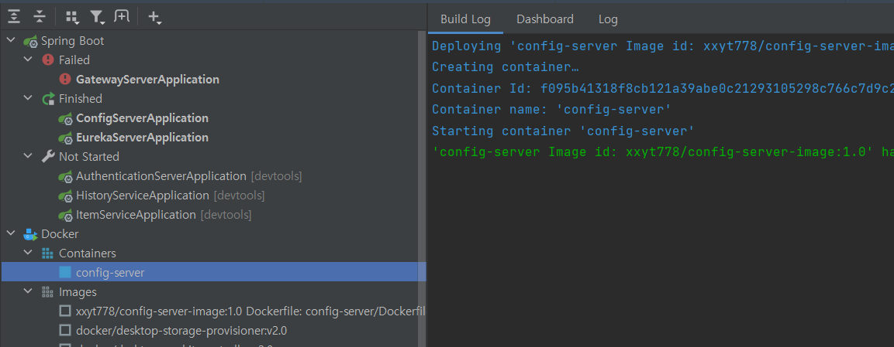

# 프로젝트 투입 전 MSA 개인 스터디

## MicroService 구현
```
https://www.inflearn.com/course/java-msa-%ED%94%84%EB%A1%9C%EC%A0%9D%ED%8A%B8-%EC%8B%A4%EC%8A%B5/dashboard 색션 0~4 실습
```


### MicroService docker 연동
```
https://www.inflearn.com/course/java-msa-%ED%94%84%EB%A1%9C%EC%A0%9D%ED%8A%B8-%EC%8B%A4%EC%8A%B5/dashboard 색션 5~6 실습

docker image build
docker build . -t xxx-server-image

docker hub에 build한 image push
[Eureka Server](https://hub.docker.com/repository/docker/xxyt778/eureka-server-image/general)
[Config Server](https://hub.docker.com/repository/docker/xxyt778/config-server-image/general)
[Gateway](https://hub.docker.com/repository/docker/xxyt778/gateway-server/general)

docker image 기반 container 실행
Maria DB
docker run --network msa-network -d -p 3307:3306 --restart=always -e MARIADB_ROOT_PASSWORD=tree6548 --name mariadb mariadb

MicroServices
docker run --network msa-network -d -p 8080:8080 --name config-server config-server-image
docker run --network msa-network -d -p 8761:8761 --name eureka-server eureka-server-image
docker run --network msa-network -d -p 8070:8070 --name gateway-server gateway-server-image
docker run --network msa-network -d -p 8900:8900 --name auth-server auth-server-image
docker run --network msa-network -d --name item-server item-service-image
docker run --network msa-network -d --name history-server history-service-image

```


Intellij에서 docker service를 연동해 container 실행 테스트
### Zipkin, Prometheus, Kafka 연동
```
https://www.inflearn.com/course/java-msa-%ED%94%84%EB%A1%9C%EC%A0%9D%ED%8A%B8-%EC%8B%A4%EC%8A%B5/dashboard 색션 7~9 실습

docker 기반 실행
docker run -d -p 9090:9090 -v C:\APPS\msa\prometeus\prometheus.yml:/etc/prometheus/prometheus.yml --add-host host.docker.internal:host-gateway --restart=always --name prometheus prom/prometheus
docker run -d -p 13000:13000 --add-host host.docker.internal:host-gateway --restart=always --name grafana grafana/grafana

(Kafka의 경우 docker container로 연동시 connect가 안되는 문제가 있어 추후 해결 필요)
```

item에 대한 history 적재를 kafka로 하도록 설정되어 있으며 추후에 login-history, manage도 topic으로 추가 가능
